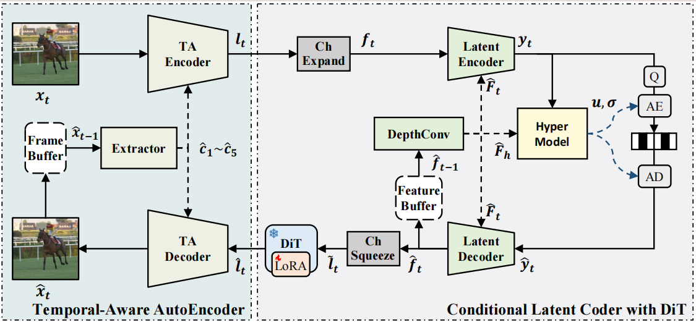
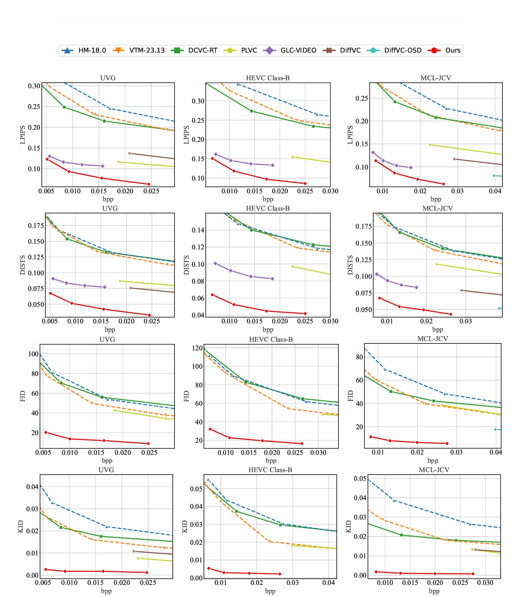

# YODA: Yet Another One-step Diffusion-based Video Compressor

<div align="center">

**[Xingchen Li](https://vision.nju.edu.cn/24/f6/c29471a730358/page.htm), [Junzhe Zhang](https://vision.nju.edu.cn/19/81/c29471a792961/page.htm), [Junqi Shi](https://vision.nju.edu.cn/ee/a0/c29471a585376/page.htm), [Ming Lu](https://vision.nju.edu.cn/fc/da/c29470a457946/page.htm), [Zhan Ma](https://vision.nju.edu.cn/fc/d3/c29470a457939/page.htm)**

**Nanjing University**

[](LICENSE)
[](https://staceyxc.github.io/Yoda_videos/)
[](https://arxiv.org/abs/2601.01141)


</div>

---

## Introduction

**YODA** is a learned video compression framework designed to achieve high perceptual reconstruction quality with efficient one-step diffusion inference.

While one-step diffusion models have demonstrated strong performance in image compression, extending them to video remains challenging because of temporal redundancy, error propagation, and inference complexity. YODA addresses these challenges through an end-to-end architecture that combines a **Temporal-Aware AutoEncoder**, a **Conditional Latent Coder**, and a lightweight **one-step linear Diffusion Transformer**.

### Highlights

* **High perceptual quality:** YODA outperforms H.266/VVC and representative learned video codecs on perceptual metrics including LPIPS, DISTS, FID, and KID.
* **One-step denoising:** A lightweight linear DiT performs denoising in a single inference step, avoiding the high latency of iterative diffusion sampling.
* **Temporal-aware representation:** The trainable Temporal-Aware AutoEncoder explicitly exploits temporal information from reference frames instead of relying on a frozen image autoencoder.
* **End-to-end video compression:** Temporal representation learning, latent coding, and perceptual reconstruction are optimized within a unified framework.

This repository provides the public **inference, bitstream generation, reconstruction, and evaluation pipeline** for YODA. Training and experiment-only code are not included.

---

## Framework

<div align="center">
  
</div>

YODA consists of three main components:

* **Temporal-Aware AutoEncoder (TA-AE):** Extracts multiscale temporal features from previously reconstructed frames and produces a compact latent representation.
* **Conditional Latent Coder (CLC):** Models temporal dependencies and performs entropy coding in the latent feature space.
* **Linear DiT Model:** Refines the decoded latent representation through efficient one-step diffusion denoising.

---

## Performance

YODA is evaluated on the **UVG**, **HEVC Class B**, and **MCL-JCV** datasets. It achieves strong perceptual rate–distortion performance compared with traditional video coding standards and recent learned video compression methods.

<div align="center">
  

  <p>
    <i>
      Perceptual quality comparisons on UVG, HEVC Class B, and MCL-JCV.
      Lower values are better for LPIPS, DISTS, FID, and KID.
    </i>
  </p>
</div>

---

## Visual Comparison

Interactive comparisons between YODA reconstructions and the corresponding ground-truth videos are available on the project page.

<div align="center">
  <a href="https://staceyxc.github.io/Yoda_videos/">
    
  </a>
</div>

---

## Repository Layout

```text
.
├── assets/                    # Figures and README assets
├── ckpts/                     # Local checkpoints, ignored by Git
├── src/                       # Codec and neural-network modules
│   └── cpp/                   # Native entropy-coding extension
├── utils/                     # Shared inference utilities
├── test.sh                    # Reproducible inference entry point
├── test_video_YODA.py         # Video coding and bitstream generation
├── eval.py                    # Reconstruction-quality evaluation
├── requirements.txt           # Python dependencies
└── README.md
```

---

## Requirements

The released inference pipeline requires:

* Linux with Bash
* Python 3.10
* A CUDA-capable NVIDIA GPU
* A PyTorch build compatible with the installed GPU and CUDA driver
* Conda or another Python environment manager

Python 3.10 is recommended because the native entropy-coding extension is compiled for the active Python environment.

---

## Environment Installation

### 1. Create the Conda environment

```bash
conda create -n yoda python=3.10 -y
conda activate yoda
```

Confirm that the correct environment is active:

```bash
which python
python --version
```

### 2. Install Python dependencies

```bash
python -m pip install --upgrade pip
python -m pip install -r requirements.txt
```

The default PyTorch package in `requirements.txt` may not match every GPU or CUDA setup. When necessary, install an appropriate CUDA-enabled PyTorch build using the [official PyTorch installation guide](https://pytorch.org/get-started/locally/), and then install the remaining dependencies.

For newer GPU architectures, verify that the installed PyTorch build contains the corresponding CUDA compute capability:

```bash
python - <<'PY'
import torch

print("PyTorch:", torch.__version__)
print("PyTorch CUDA:", torch.version.cuda)
print("CUDA available:", torch.cuda.is_available())

if torch.cuda.is_available():
    print("GPU:", torch.cuda.get_device_name(0))
    print("GPU capability:", torch.cuda.get_device_capability(0))
    print("Compiled CUDA architectures:", torch.cuda.get_arch_list())
PY
```

### 3. Build the native entropy coder

Install the C++ extension from the repository root:

```bash
python -m pip install -U pybind11 setuptools wheel
python -m pip install -e ./src/cpp --no-build-isolation
```

The `--no-build-isolation` option allows the build process to use the `pybind11` package installed in the current Conda environment.

Verify the installation:

```bash
python -c "import MLCodec_extensions_cpp; print('Entropy coder: OK')"
```

---

## Checkpoints and Configuration

YODA inference requires:

1. The pretrained SANA-Sprint model.
2. The YODA inter-frame codec checkpoint.
3. The YODA intra-frame codec checkpoint.
4. Cached prompt embeddings and attention masks.
5. A dataset configuration file.

### 1. Download SANA-Sprint

Download the pretrained
[SANA-Sprint checkpoint](https://huggingface.co/Efficient-Large-Model/Sana_Sprint_0.6B_1024px_diffusers/tree/main)
from Hugging Face.

The downloaded model directory should contain at least:

```text
sana-sprint/
├── scheduler/
├── transformer/
└── vae/
```

### 2. Download YODA checkpoints

Both the inter-frame and intra-frame checkpoints are available from the [YODA Hugging Face repository](https://huggingface.co/staceylee/YODA/tree/main).

| Checkpoint            | Description                         | Download                                                        |
| --------------------- | ----------------------------------- | --------------------------------------------------------------- |
| YODA video checkpoint | Inter-frame video compression model | [Hugging Face](https://huggingface.co/staceylee/YODA/tree/main) |
| YODA intra checkpoint | Intra-frame compression model       | [Hugging Face](https://huggingface.co/staceylee/YODA/tree/main) |

The checkpoints may be stored anywhere outside the Git repository. The local `ckpts/` directory is ignored by Git and can optionally be used to organize the downloaded model files.


A recommended directory structure is:

```text
checkpoints/
├── sana-sprint/
│   ├── scheduler/
│   ├── transformer/
│   └── vae/
├── yoda_video.pth
├── yoda_intra.pth
├── prompt_embeds.pt
└── prompt_attention_mask.pt
```

---

## Data Preparation

YODA was trained using the [Vimeo-90K](http://toflow.csail.mit.edu/) dataset and evaluated on:

* UVG
* HEVC Class B
* MCL-JCV

The source sequences should be prepared according to the format specified in the test configuration file.

The configuration file defines:

* Dataset root
* Sequence names
* Frame width and height
* Number of frames
* Frame rate
* Source format
* Intra period and evaluation settings

An example configuration structure is:

```json
{
  "root_path": "/path/to/dataset",
  "sequences": [
    {
      "name": "SequenceName",
      "width": 1920,
      "height": 1080,
      "frames": 96,
      "format": "yuv420"
    }
  ]
}
```

Adjust the fields according to the configuration format used by `test_video_YODA.py`.

---

## Running Inference

The following command provides an example for evaluating YODA on the HEVC Class B dataset:

```bash
CUDA_VISIBLE_DEVICES=0 python test_video_YODA.py \
    --pretrained_weights /path/to/yoda_video.pth \
    --pretrained_i_weights /path/to/yoda_intra.pth \
    --prompt_attention_mask_path /path/to/prompt_attention_mask.pt \
    --prompt_embeds /path/to/prompt_embeds.pt \
    --lora_rank_transformer 72 \
    --test_config ./config_hevc_B.json \
    --save_decoded_frame True \
    --cuda 1 \
    -w 1 \
    --timestep 100 \
    --timestep_i 999 \
    --write_stream 1 \
    --output_path ./output.json \
    --cuda_idx 0 \
    --check_existing 0 \
    --rate_num 1 \
    --force_intra_period 32 \
    --calc_ssim True \
    --lora_rank_transformer_video 72 \
    --reset_interval 1000 \
    --sd_path /path/to/sana_sprint_0.6b_1024 \
    --run_fast True
```

Replace the checkpoint, prompt tensor, SANA-Sprint, and dataset configuration paths with the corresponding local paths.

> **Memory requirement:** Full-precision inference on 1080p video may require more than 24 GB of GPU memory. The actual memory consumption depends on the input resolution, model configuration, inference implementation, and software environment. A GPU with more than 24 GB of memory is recommended for full-precision 1080p evaluation.

In this example:

* `--pretrained_weights` specifies the YODA inter-frame checkpoint.
* `--pretrained_i_weights` specifies the YODA intra-frame checkpoint.
* `--sd_path` specifies the local SANA-Sprint model directory.
* `--test_config` specifies the dataset configuration file.
* `--save_decoded_frame True` saves reconstructed frames for subsequent quality evaluation.
* `--write_stream 1` enables bitstream generation.
* `-w 1` uses one worker process.


## Evaluating Reconstructed Videos

After generating reconstructed videos, use `eval.py` to calculate quality metrics.

Example for HEVC Class B:

```bash
python eval.py \
  --orig_dir /path/to/HEVC_test_sequences/ClassB/ \
  --recon_dirs ./out_bin/HEVC_B \
  --width 1920 \
  --height 1080 \
  --num_frames 96 \
  --log_dir ./Log
```

The evaluation script reports metrics including:

* Bits per pixel
* PSNR
* MS-SSIM
* LPIPS
* DISTS

---


## Acknowledgments

We thank the authors of the following projects for their contributions and open-source implementations:

* [DCVC-RT](https://github.com/microsoft/DCVC): Towards Practical Real-Time Neural Video Compression.
* [SANA](https://github.com/NVlabs/SANA): Efficient High-Resolution Image Synthesis with Linear Diffusion Transformers.
* [DC-AE](https://hanlab.mit.edu/projects/dc-ae): Deep Compression Autoencoder.
* [StableCodec](https://github.com/LuizScarlet/StableCodec): StableCodec: Taming One-Step Diffusion for Extreme Image Compression.
---

## Citation

The citation information will be updated when the final IEEE Xplore record becomes available.

```bibtex
@ARTICLE{11614008,
  author={Li, Xingchen and Zhang, Junzhe and Shi, Junqi and Lu, Ming and Ma, Zhan},
  journal={IEEE Transactions on Circuits and Systems for Video Technology}, 
  title={YODA: Yet Another One-step Diffusion-based Video Compressor}, 
  year={2026},
  volume={},
  number={},
  pages={1-1},
  keywords={Modeling;Videos;Noise reduction;Decoding;Codes;Encoding;LoRa;Training;Conferences;High efficiency video coding;Temporal Awareness;Conditional Coding;Diffusion Transformer;Video Compression},
  doi={10.1109/TCSVT.2026.3714453}}
```

---

## License

This repository is released under the [Apache License 2.0](LICENSE).

Users are responsible for complying with the licenses and terms of all third-party models, datasets, and adapted components, including SANA, DC-AE, and DCVC-RT.

---

